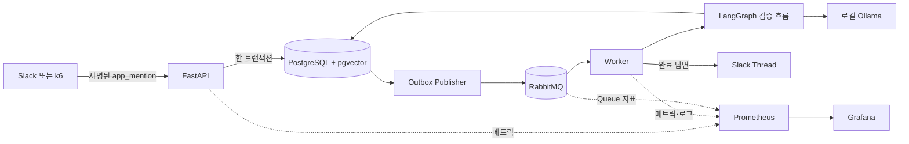
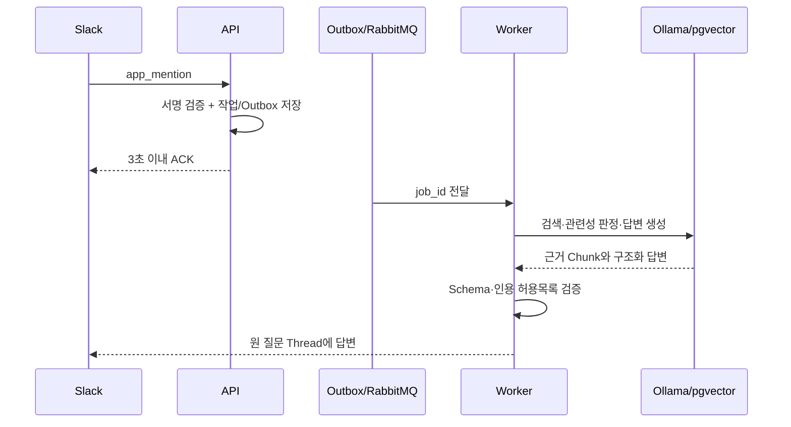
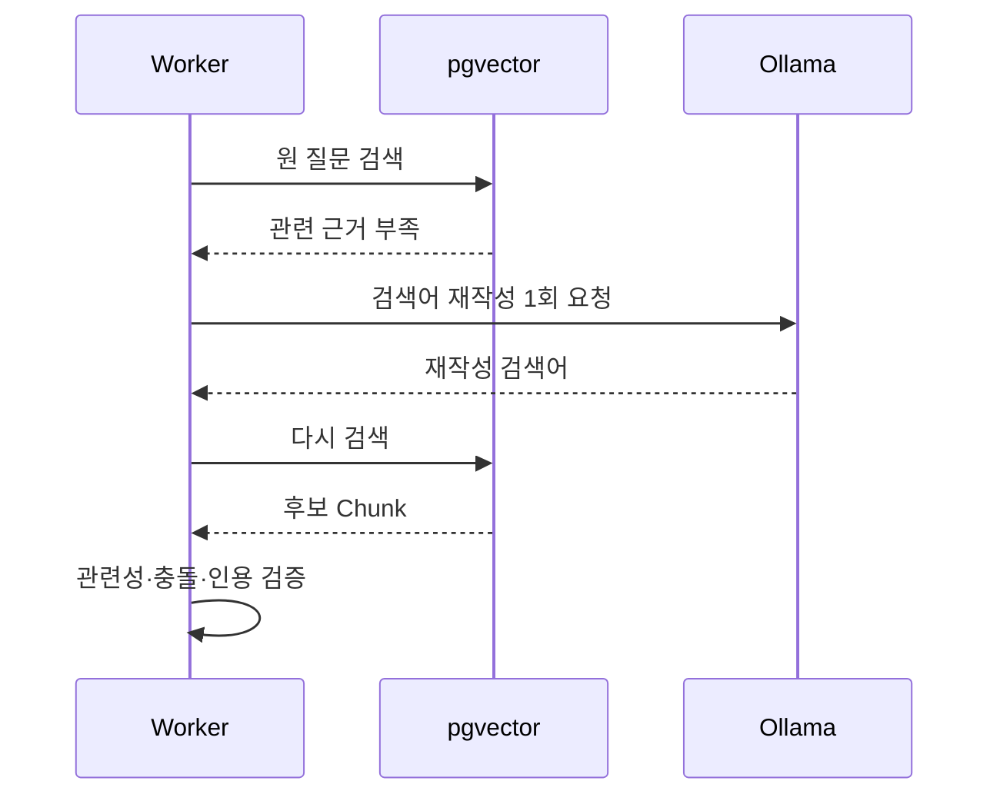
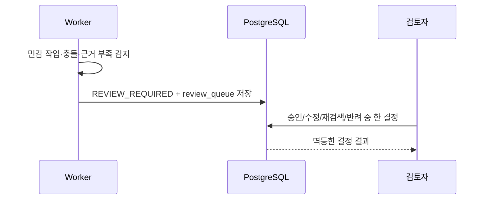
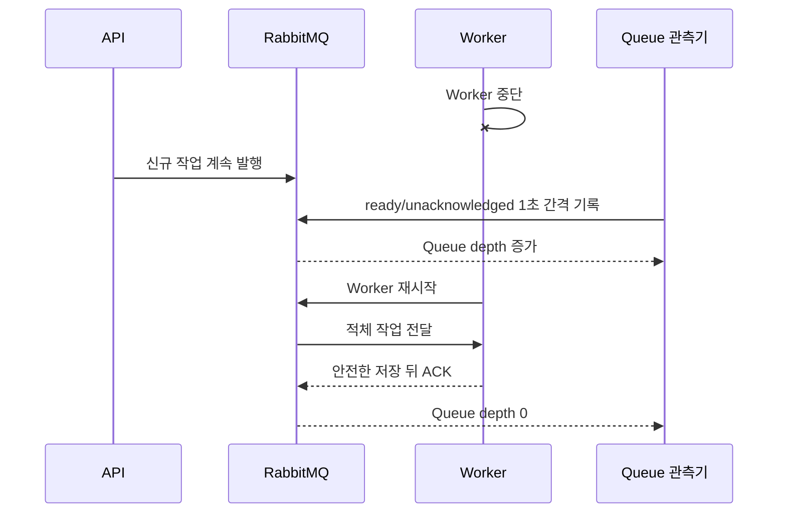

# 부하 테스트와 Queue 복구 측정 가이드

## 1. 무엇을 따로 측정하는가

Slack에서 질문 한 건이 정상 답변으로 끝나는지만 확인하면 기능 검증은 되지만, 순간 요청과 장애 상황에서 유실·중복·지연이 어떻게 변하는지는 알 수 없다. 이 단계는 다음 두 경계를 분리한다.

1. **Webhook 접수 경계**: 서명 검증, PostgreSQL 작업·Outbox 트랜잭션, 멱등 처리까지의 ACK 지연을 k6로 측정한다.
2. **비동기 처리 경계**: RabbitMQ의 `ready`와 `unacknowledged` 메시지를 1초 간격으로 기록해 적체와 해소를 확인한다.

LLM 생성시간은 ACK에 포함하지 않는다. API가 `2xx`를 반환한 뒤 Outbox Publisher와 Worker가 나머지를 처리하는 것이 이 프로젝트의 핵심 구조다.

k6는 [AGPL-3.0 라이선스의 무료 오픈소스 도구](https://github.com/grafana/k6)이며 `grafana/k6:1.8.1` 이미지를 고정해 [공식 Docker 실행 방식](https://grafana.com/docs/k6/latest/get-started/running-k6/)으로 로컬에서만 실행한다. Grafana Cloud 실행과 유료 API는 사용하지 않고 사용량 보고도 비활성화했다.

## 2. 전체 흐름



## 3. k6 Webhook 시나리오

`load-tests/k6/slack-webhook.js`는 실제 Slack v0 규격으로 원본 JSON 본문에 HMAC-SHA256 서명을 붙인다. 합성 `app_mention`만 사용하며 실제 Workspace나 Token은 필요 없다.

기본 합격 기준은 다음과 같다.

- HTTP 실패율 1% 미만
- Check 성공률 99% 초과
- ACK p95 3초 미만
- 3초 미만 ACK 비율 99% 초과

중복 폭주는 같은 `event_id`를 여러 번 보내 접수 지연과 DB UNIQUE 멱등성을 확인한다. 100건을 보내도 LLM 작업은 한 건만 만들어지므로 접수 계층을 측정하면서 로컬 Ollama에 100건을 쌓지 않는다.

```powershell
docker compose up --build -d postgres rabbitmq api outbox-publisher worker

docker compose --profile loadtest run --rm --no-deps `
  -e MODE=duplicate `
  -e REQUESTS=100 `
  -e VUS=20 `
  -e RUN_ID=ack-burst-v1 `
  -e SUMMARY_PATH=/results/ack-burst-v1.json `
  k6
```

고유 이벤트 시나리오는 실제로 요청 수만큼 작업을 만든다. 로컬 CPU Ollama가 각 작업을 순차 처리하므로 기본값을 작게 유지한다.

```powershell
docker compose --profile loadtest run --rm --no-deps `
  -e MODE=unique `
  -e REQUESTS=5 `
  -e VUS=5 `
  -e RUN_ID=queue-recovery-v1 `
  -e SUMMARY_PATH=/results/queue-recovery-v1-k6.json `
  k6
```

결과 JSON은 `load-tests/results`에 저장되며 질문과 내부 결과가 섞일 수 있어 Git에서 제외한다. `RUN_ID`는 매 실험마다 새 값으로 바꾼다.

## 4. Worker 중단 중 적체와 재시작 후 해소

이 실험은 실제 Slack 발신을 끈 로컬 환경에서만 수행한다. 시작 전에 `SLACK_REPLY_ENABLED=false`인지 확인하고 Queue가 비어 있는지 확인한다.

```powershell
docker compose exec -T rabbitmq rabbitmqctl list_queues name messages_ready messages_unacknowledged consumers
docker compose stop worker

docker compose --profile loadtest run -d --rm --no-deps `
  -e LOADTEST_QUEUE_MAX_SAMPLES=900 `
  -e LOADTEST_QUEUE_INTERVAL_SECONDS=1 `
  -e LOADTEST_QUEUE_OUTPUT_PATH=/results/queue-recovery-v1.jsonl `
  load-observer

docker compose --profile loadtest run --rm --no-deps `
  -e MODE=unique `
  -e REQUESTS=5 `
  -e VUS=5 `
  -e RUN_ID=queue-recovery-v1 `
  -e SUMMARY_PATH=/results/queue-recovery-v1-k6.json `
  k6

docker compose exec -T rabbitmq rabbitmqctl list_queues name messages_ready messages_unacknowledged consumers
docker compose start worker
```

관측기는 한 번이라도 적체를 본 뒤 `ready + unacknowledged`가 0이 되면 종료한다. 한도까지 적체가 나타나지 않았으면 `drained=false`로 끝나므로 “복구 성공”으로 오인하지 않는다. 각 JSONL 행은 시각, 대기 메시지, 처리 중 메시지, 합계와 Consumer 수만 포함하며 질문·답변·Secret은 기록하지 않는다.

## 5. Worker 1개와 복수 Worker 비교

비교할 때는 같은 질문 수, 같은 모델, 같은 검색 설정을 고정하고 Worker 수만 바꾼다. 한 실행의 Queue와 작업이 모두 끝난 뒤 다음 실행을 시작한다.

```powershell
# Worker 1개
docker compose up -d --scale worker=1

# Worker 2개
docker compose up -d --scale worker=2
```

단일 CPU Ollama 인스턴스를 공유하면 Worker를 늘려도 생성 모델 자체가 빨라지지 않는다. 9단계의 동일 60건 실제 비교에서 Worker 2개는 Worker 1개보다 처리량이 약 5.0% 낮았고 p95는 약 90.6% 높았다. 이 결과는 WSL2·CPU·`qwen3:1.7b` 한 인스턴스에 한정하며 GPU나 Ollama 다중 인스턴스로 일반화하지 않는다.

실제 Rabbit Worker 비교에서는 실행 ID별 작업을 다음 읽기 전용 SQL로 집계한다. 완료되지 않은 행은 p95 분모에 넣지 않는다.

```powershell
docker compose exec -T postgres psql -U rag_harness -d rag_harness -c @'
SELECT
  status,
  count(*) AS jobs,
  round(percentile_cont(0.95) WITHIN GROUP (
    ORDER BY extract(epoch FROM (completed_at - created_at)) * 1000
  )::numeric, 2) AS completed_p95_ms
FROM ai_job
WHERE source = 'SLACK'
  AND external_event_id LIKE 'Ev_LOAD_queue-recovery-v1_%'
GROUP BY status
ORDER BY status;
'@
```

## 6. 정상·재검색·검토·복구 시퀀스

### 정상 답변



### 검색어 재작성



### 사람 검토 전환



### 장애 중 적체와 복구



## 7. Grafana 캡처 목록

블로그나 면접 자료에는 사용자 질문 원문과 Secret이 보이지 않는지 먼저 확인한 뒤 다음 화면을 캡처한다.

- k6 실행 직전·직후 API 요청량과 p95
- Worker 중단 뒤 `rag_harness.jobs` Queue depth 최고점
- Worker 재시작 뒤 Queue depth가 0으로 감소하는 구간
- `PROCESSING`, `COMPLETED`, `REVIEW_REQUIRED` 상태 변화
- Workflow 전체·노드별 p95
- Ollama 작업별 p95
- 재시도·DLQ 패널과 오류 코드가 있는 안전한 구조화 로그
- Slack PC 앱의 정상 Thread 답변
- Slack PC 앱 질문이 사람 검토로 전환된 관리 화면

마지막 두 Slack 화면은 무료 Workspace의 실제 설정이 필요하므로 자동 테스트 산출물로 대체하지 않는다.

## 8. 결과를 해석할 때 주의할 점

- ACK p95가 빠르다는 사실은 답변 생성이 빠르다는 뜻이 아니다. 접수와 비동기 처리의 분리만 증명한다.
- 중복 폭주는 멱등성과 접수 용량을 측정하지만 LLM 처리량은 측정하지 않는다.
- Queue가 0이 됐다는 사실만으로 작업 성공을 단정하지 않는다. PostgreSQL의 최종 상태와 실패율을 함께 확인한다.
- Worker 수 비교는 모델 인스턴스, CPU/GPU, 데이터 수와 질문 구성을 함께 기록한다.
- Cold Run과 Warm Run을 구분하고 기대와 다른 결과도 삭제하거나 보정하지 않는다.

## 9. 2026-10-09 실제 로컬 측정

측정 환경은 WSL2 Linux x86_64, 논리 CPU 16개, Docker Compose, k6 1.8.1, Worker 1개, `qwen3:1.7b`, `nomic-embed-text`다. 문서와 모델이 이미 준비된 Warm Run이며 Slack 발신은 비활성화했다. 첫 스모크 실행은 이미지 내려받기와 API 재시작이 포함돼 표에서 제외했다.

### Webhook ACK

| 실행 | 모드 | 요청/VU | 생성/중복 | 요청 처리량 | ACK p95 | 최대 | 실패율 |
| --- | --- | ---: | ---: | ---: | ---: | ---: | ---: |
| `ack-burst-20261009` | 같은 `event_id` | 100/20 | 1/99 | 66.783 req/s | 455.72ms | 538.44ms | 0% |
| `queue-recovery-20261009` | 고유 `event_id` | 5/5 | 5/0 | 165.635 req/s | 28.16ms | 28.28ms | 0% |

두 실행 모두 Check와 3초 이내 ACK 비율은 100%였다. 5건 실행의 요청 처리량은 표본이 너무 작으므로 100건 실행과 속도를 직접 비교하지 않는다.

### Queue 적체와 처리

Worker를 멈춘 뒤 고유 작업 5건을 접수했다. 직전 중복 폭주가 만든 유일한 실제 작업 한 건이 처리 중 Worker 중단으로 재전달돼 Queue 최고값은 합계 6이었다. 이 선행 작업을 숨기거나 5로 보정하지 않았다.

| 항목 | 실제 값 |
| --- | ---: |
| Queue 표본 | 247건, 1초 간격 |
| 최대 `ready` / `unacknowledged` / 합계 | 6 / 1 / 6 |
| 관측 시작부터 Queue 0까지 | 247.451초 |
| 고유 실험 작업 완료 | 5/5 |
| 고유 작업 End-to-End p95 | 227,505.44ms |
| 고유 작업 최대 End-to-End | 236,618.78ms |
| 고유 작업 처리량 | 0.021131 jobs/s |

ACK p95는 28.16ms였지만 End-to-End p95는 약 227.5초였다. API 접수는 빠르고 단일 CPU Ollama가 비동기 처리 병목이라는 차이를 실제 값으로 확인했다.

### Worker 중단 복구

선행 작업은 Worker가 `grade_documents`를 실행하던 중 중단돼 DB에 `PROCESSING`, `attempt_count=1`로 남았다. 기본 Lease 900초를 기다리는 대신 이 실험에서만 Lease 10초와 재시도 기준 1초를 주입했다. Recovery Scheduler가 `WORKER_LEASE_EXPIRED`를 기록하고 `attempt_count=2`로 재선점했으며, PostgreSQL Checkpoint에서 `grade_documents`부터 재개해 `COMPLETED`로 끝났다. 분류와 검색 노드는 다시 실행하지 않았다.

복구 메시지가 Queue에 보인 시점부터 ACK로 0이 될 때까지 40.216초였고 최대 메시지 합계는 1이었다. 실험 뒤 Worker 설정은 `WORKER_PROCESSING_LEASE_SECONDS=900`, `WORKER_RETRY_BASE_SECONDS=5`, 로컬 관련성 판정기로 복원했다.
