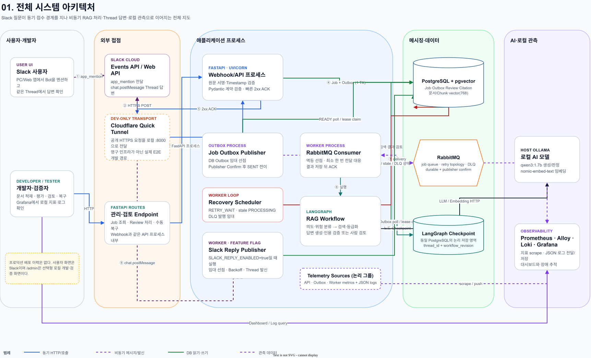

# 포트폴리오 — Slack RAG Harness

## 한 줄 소개

Slack의 3초 ACK 제약과 느린 로컬 LLM 실행을 분리하고, 검색 근거 검증·멱등성·장애 복구·관측 가능성을 구현한 비동기 AI 하네스다.

이 프로젝트는 프로덕션 운영 서비스가 아니다. Windows와 WSL2의 Docker Compose, 무료 Slack Workspace, 로컬 Ollama 환경에서 운영에 필요한 메커니즘을 구현하고 재현 가능한 테스트·평가·부하 실험으로 검증했다.

## 해결하려 한 문제

Slack Events API는 빠른 ACK를 요구하지만 로컬 LLM 답변에는 수십 초 이상이 걸릴 수 있다. API 요청 안에서 검색과 생성을 모두 수행하면 Slack 재전송, 중복 작업, 타임아웃과 처리 중단 복구 문제가 생긴다. 또한 RAG가 검색한 문서와 무관한 답을 만들거나 존재하지 않는 사내 절차를 일반 지식으로 만들어내지 않도록 별도 검증 경계가 필요했다.

## 핵심 설계

1. API는 Slack 서명과 Timestamp를 검증하고 Job·Outbox를 한 트랜잭션으로 저장한 뒤 즉시 ACK한다.
2. Outbox Publisher는 PostgreSQL에서 메시지를 선점하고 Publisher Confirm이 적용된 RabbitMQ로 전달한다.
3. Worker는 조건부 상태 변경으로 작업을 선점하고 LangGraph Workflow에서 pgvector 검색과 로컬 Ollama 생성을 수행한다.
4. 검색 점수, Chunk 관련성, 문서 충돌, Pydantic Schema, 인용 ID를 독립적으로 검증한다.
5. 근거 부족·문서 충돌·민감 작업은 자동 완료하지 않고 사람 검토로 전환한다.
6. Checkpoint, Lease, 제한 재시도와 DLQ로 Worker 중단과 일시 오류를 복구한다.
7. Prometheus, Grafana, Loki로 ACK 지연, 작업 상태, Queue, 노드·Ollama 지연과 구조화 로그를 관측한다.

## 실제 검증 결과

| 검증 | 결과 | 의미 |
| --- | --- | --- |
| 회귀 테스트 | 106 passed, 4.40s | 외부 Slack·유료 LLM 없이 계약과 장애 경로 검증 |
| Slack E2E | 실제 `app_mention` → 동일 Thread 답변 | Events API부터 Slack 발신까지 연결 확인 |
| 중복 Webhook | 100건 성공, DB 작업 1건 | `event_id` UNIQUE 기반 멱등성 확인 |
| Webhook ACK | p95 455.72ms, 최대 538.44ms, 실패율 0% | 느린 LLM과 빠른 접수 경계 분리 |
| Queue 복구 | 고유 작업 5/5 완료, 최대 Queue 합계 6 | Worker 중단 중에도 접수된 작업 보존 |
| Checkpoint 복구 | `grade_documents`부터 재개, 40.216초 뒤 ACK | 완료 노드를 반복하지 않는 중단 복구 |
| 평가 하네스 | 고정 데이터셋 60건 | 같은 입력으로 검색·생성 설정 비교 |

모든 수치는 WSL2 Linux x86_64, 논리 CPU 16개, Worker 1개, `qwen3:1.7b`, `nomic-embed-text`의 로컬 Warm Run에 한정한다. 서로 다른 표본 크기의 처리량을 직접 비교하지 않았고, 실패로 짧아진 실행 결과는 성능 개선으로 사용하지 않았다.

## 주요 의사결정과 트레이드오프

- Top-K 8은 Recall이 7%p 높았지만 기준보다 느리고 Timeout이 발생해, 실패가 없던 Top-K 5를 기본값으로 유지했다.
- Worker 2개는 단일 CPU Ollama 경합으로 Worker 1개보다 처리량이 약 5.0% 낮고 p95가 약 90.6% 높았다.
- 검색어 재작성을 끄면 성능 차이는 작았지만 Recall과 검토 전환 정확도가 낮아져 최대 1회 재작성을 유지했다.
- 최소 점수 0.2는 기준과 검색 집합이 같아 임계값 변경 근거가 되지 못했다.
- Queue가 0이어도 DB에 Lease가 남은 `PROCESSING` 작업이 있을 수 있어 Queue와 Job 상태를 함께 확인하도록 했다.

## 면접에서 설명할 흐름

> Slack 챗봇 기능보다 실패해도 이어지는 AI 실행 경계를 만드는 데 집중했습니다. API는 서명 검증과 Job·Outbox 저장까지만 수행해 3초 안에 ACK하고, RabbitMQ Worker가 로컬 Ollama 기반 RAG를 비동기로 처리합니다. 중복 이벤트는 DB UNIQUE로 차단하고, 검색 근거와 인용은 LLM 밖에서 검증하며 근거가 부족하면 사람 검토로 전환합니다. Worker를 실제로 중단해 Queue 적체와 Checkpoint 재개를 확인했고, 60건 고정 데이터셋과 k6 부하 테스트로 설정별 품질·지연과 ACK 성능을 측정했습니다.

## 데모 순서

1. 전체 시스템 아키텍처에서 동기 ACK와 비동기 AI 처리 경계를 설명한다.
2. Slack에서 문서에 존재하는 질문을 보내고 동일 Thread 답변을 확인한다.
3. Grafana에서 API 요청, 작업 상태, Workflow·Ollama 지연과 구조화 로그를 확인한다.
4. 문서에 없는 질문을 보내고 임의 답변 대신 `REVIEW_REQUIRED`가 생성되는지 확인한다.
5. 장애 복구 그림과 실측 결과로 Worker 중단 시 Queue 적체와 Checkpoint 재개를 설명한다.

## 공개 전 수동 증빙

| 증빙 | 상태 | 캡처 기준 |
| --- | --- | --- |
| 전체 시스템 아키텍처 | 완료 | `docs/architecture/01-system-overview.png` 사용 |
| Slack 정상 Thread 답변 | 동작 확인, 공개용 캡처 필요 | 사용자·Workspace·채널 ID와 Tunnel 주소 익명화 |
| 사람 검토 전환 | 수동 E2E 필요 | 근거 부족 질문과 `REVIEW_REQUIRED` 상태를 함께 표시 |
| Grafana 대시보드 | 수동 캡처 필요 | 시간 범위 Last 15 minutes, 질문 3~5건 처리 후 캡처 |
| Queue 적체·복구 | 실측 완료 | 기존 결과 표 사용 또는 재현 화면을 선택적으로 캡처 |

실제 Token, Signing Secret, 개인 정보, 실제 회사 문서와 로컬 `.env`는 이미지와 Git 기록에 포함하지 않는다.

## 한계와 다음 개선

- 실제 프로덕션 배포, 다중 사용자 트래픽, SLA와 온콜 운영 경험은 포함하지 않는다.
- 품질·성능 결론은 작은 가상 문서와 단일 로컬 CPU 환경에 한정된다.
- 생성 결과의 비결정성 때문에 작은 지표 차이는 반복 실행과 분산 확인이 필요하다.
- 관리 화면은 로컬 개발용이며 외부 공개 전 인증·권한·감사 주체 기록이 필요하다.
- 다음 성능 비교 후보는 Worker 수 증가보다 모델 양자화, GPU 또는 Ollama 인스턴스 분리다.
