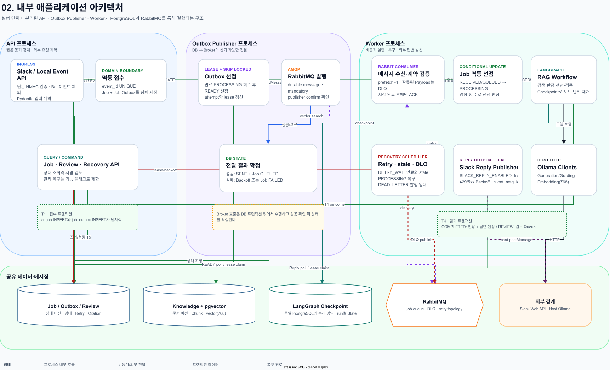
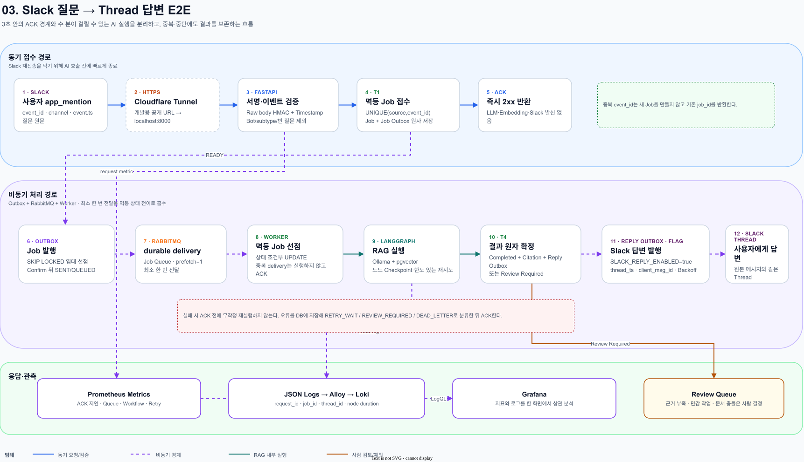
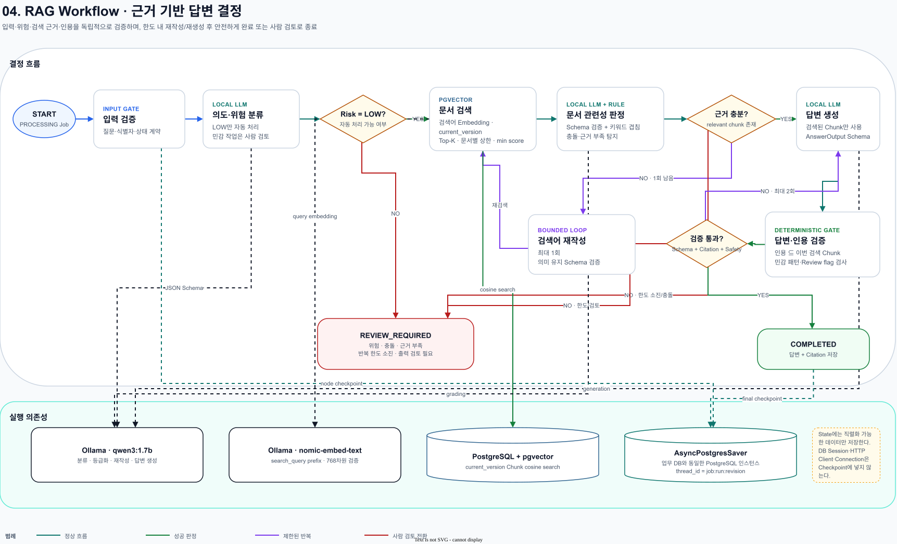
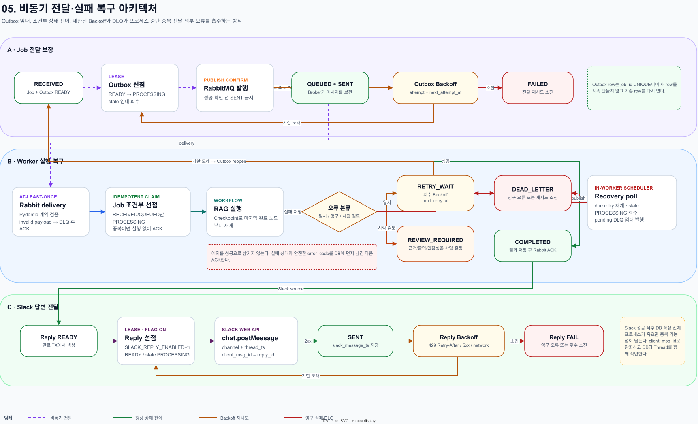
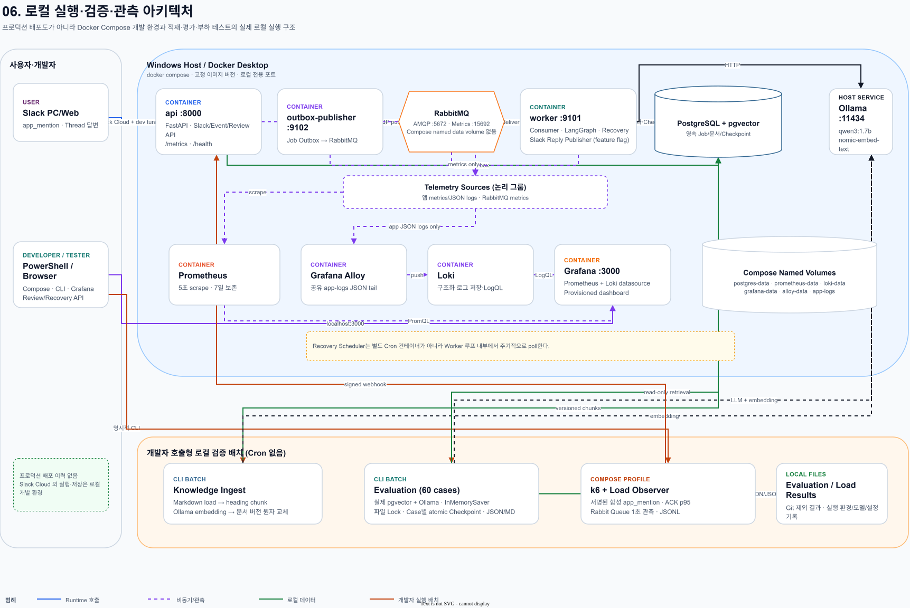

# 시스템 아키텍처 설명과 코드 근거

## 1. 시스템의 목적과 핵심 설계

`slack-rag-harness`는 단순한 Slack 챗봇보다 **복구 가능한 로컬 AI 실행 하네스**에 가깝다. Slack 요청을 짧은 동기 구간에서 검증·저장하고, 느린 검색·LLM 실행과 답변 발행을 비동기로 분리한다. 각 경계에는 고유 키, Outbox, 조건부 상태 전이, 임대, 제한된 재시도, Checkpoint가 있어 중복 전달과 프로세스 중단을 재현 가능한 복구 시나리오로 다룬다.

핵심 원칙은 다음과 같다.

1. Slack에는 AI 처리를 기다리지 않고 빠르게 `2xx`를 반환한다.
2. Job과 Job Outbox는 같은 트랜잭션에 저장해 DB 저장과 메시지 발행 사이의 유실 구간을 없앤다.
3. RabbitMQ는 최소 한 번 전달을 전제로 하며 Worker가 DB 상태를 조건부로 선점한다.
4. LLM 출력은 Pydantic Schema, 검색 근거, 인용 집합, 민감 패턴을 각각 검증한다.
5. 검색 근거가 없거나 충돌·민감성이 있으면 답을 꾸며내지 않고 `REVIEW_REQUIRED`로 전환한다.
6. `COMPLETED` 경로는 Job 결과·Citation·Slack Reply Outbox를, `REVIEW_REQUIRED` 경로는 Job 상태·Review Queue를 각각 한 트랜잭션에서 확정한다.
7. 모델·DB·Broker·Slack 오류는 유형에 따라 제한된 Backoff, 사람 검토, DLQ로 분기한다.

## 2. 실제 구성요소와 책임

| 영역 | 구현 구성요소 | 책임 |
|---|---|---|
| 사용자 접점 | Slack PC/Web, Slack Cloud | `app_mention` 입력, 원본 Thread에서 답변 표시 |
| 개발용 외부 접점 | Cloudflare Quick Tunnel | Slack의 공개 HTTPS POST를 로컬 FastAPI로 전달. 테스트 전용이며 고정 운영 인프라가 아님 |
| API 프로세스 | FastAPI + Uvicorn | Raw body 서명·Timestamp 검증, URL verification, 이벤트 정규화, 멱등 접수, Job/Review/Recovery API, Health/Metrics |
| Job 발행 프로세스 | Outbox Publisher | DB Outbox 임대 선점, RabbitMQ durable 발행, Publisher Confirm 이후 상태 확정 |
| 메시지 Broker | RabbitMQ | Job Queue와 DLQ 보관, 최소 한 번 전달, retry topology 선언 |
| Worker 프로세스 | Rabbit Consumer, LangGraph, Recovery Scheduler, Slack Reply Publisher | 멱등 Job 선점, RAG 실행, Checkpoint 재개, 실패 분류·복구, 기능 플래그가 켜진 경우 Thread 답변 발행 |
| AI 실행 | Host Ollama | `qwen3:1.7b`로 분류·등급화·재작성·답변 생성, `nomic-embed-text`로 768차원 임베딩 |
| 업무·검색 데이터 | PostgreSQL + pgvector | Job 상태, Outbox, Review, Citation, 문서 버전·Chunk·Vector, LangGraph Checkpoint |
| 관측 | Prometheus, Grafana Alloy, Loki, Grafana | 지표 수집, 구조화 JSON 로그 전달·저장, 지표/로그 상관 분석 |
| 개발자 호출형 로컬 배치 | Knowledge Ingest, Evaluation, k6 + Load Observer | 문서 버전 적재, 60건 평가와 재개 가능한 Checkpoint, Slack ACK/Queue 복구 부하 측정 |

선택형 Jev 문서 관련성 판정 코드도 구현되어 있지만 기본값은 Ollama다. 또한 확인된 무료 사용 기한인 `2026-09-25`가 지나면 Worker가 Jev 외부 호출을 자동으로 비활성화하고 Ollama를 사용한다. 따라서 현재 주 런타임 다이어그램에는 Jev를 실행 의존성으로 넣지 않았다.

### 프론트엔드 판단

저장소에는 독립적인 SPA/SSR 프론트엔드가 없다. 사용자 UI는 Slack이고, 개발·검증용 로컬 UI는 Grafana와 선택형 `/admin`이다. 따라서 다이어그램에서 Slack을 사용자 화면으로, FastAPI를 백엔드 진입점으로 표현했다.

## 3. 전체 요청 흐름

### 3.1 동기 접수

1. 사용자가 Bot을 멘션하면 Slack Cloud가 `app_mention` Event를 전송한다.
2. 로컬 E2E에서는 Cloudflare Quick Tunnel이 공개 HTTPS 요청을 `localhost:8000`으로 전달한다.
3. FastAPI는 Body를 변형하기 전에 Slack Signature와 Timestamp를 검증하고, `url_verification`에는 challenge를 반환한다.
4. Bot 메시지, subtype, 빈 질문을 제외하고 내부 Event Schema로 정규화한다.
5. `ai_job`과 `job_outbox`를 한 트랜잭션에 저장한다. `(source, external_event_id)` UNIQUE가 Slack 재전송을 흡수한다.
6. LLM, Embedding, Slack Web API를 호출하지 않은 상태로 `2xx`를 반환한다.

### 3.2 비동기 실행

1. Outbox Publisher는 먼저 임대가 만료된 `PROCESSING` Outbox를 `READY` 또는 최종 실패로 회수한 뒤, 재시도 시각이 지난 `READY` 행을 `FOR UPDATE SKIP LOCKED`로 선점한다.
2. RabbitMQ Publisher Confirm이 성공하면 Outbox를 `SENT`, Job을 `QUEUED`로 확정한다. Broker 호출 중 DB 트랜잭션을 유지하지 않는다.
3. Worker는 Rabbit Payload를 Pydantic으로 검증하고, Job이 `RECEIVED` 또는 `QUEUED`일 때만 `PROCESSING`으로 조건부 변경한다.
4. 중복 delivery는 선점에 실패하므로 Workflow를 다시 실행하지 않고 ACK한다.
5. LangGraph가 검색·판정·답변·검증을 실행하고 업무 데이터와 같은 PostgreSQL 인스턴스의 Checkpoint 테이블에 노드 진행을 남긴다.
6. 결과 저장 또는 안전한 실패 저장이 끝난 뒤 Rabbit delivery를 ACK한다.

### 3.3 결과와 Slack 답변

1. 정상 결과는 Job `COMPLETED`, `answer_citation`, `slack_reply_outbox`를 같은 트랜잭션에서 확정한다.
2. 자동 처리가 안전하지 않으면 Job과 `review_queue`를 같은 트랜잭션에서 `REVIEW_REQUIRED`로 확정한다.
3. `SLACK_REPLY_ENABLED=true`이면 Slack Reply Publisher가 Reply Outbox를 임대 선점한다. 수신 Event에 기존 `thread_ts`가 있으면 이를 유지하고, 없으면 `event.ts`를 새 Thread의 `thread_ts`로 사용한다.
4. `chat.postMessage`에는 `client_msg_id=reply_id`를 전달한다. 429, 네트워크 오류, 5xx는 제한된 Backoff 후 재시도하고 영구 오류 또는 소진은 `FAIL`로 남긴다.

## 4. 내부 프로세스와 데이터 경계

세 프로세스는 코드를 공유하지만 실행 단위와 장애 경계가 다르다.

- **API**는 외부 요청 계약과 짧은 DB 트랜잭션까지만 책임진다.
- **Outbox Publisher**는 DB에 확정된 전달 의도를 Broker 메시지로 바꾼다.
- **Worker**는 Broker 소비, AI Workflow, Recovery, Slack Reply 발행을 담당한다.

PostgreSQL이 업무 상태의 원본이다. RabbitMQ 메시지는 실행 신호이며, 중복 여부는 DB 상태 조건으로 결정한다. LangGraph Checkpoint도 별도 DB 서버가 아니라 이 PostgreSQL 인스턴스에 저장된다. 이 분리 덕분에 Broker가 같은 메시지를 다시 전달하거나 Worker가 재시작해도 이미 확정된 Job을 중복 실행하지 않는다.

## 5. 트랜잭션과 외부 호출 경계

| 경계 | 한 트랜잭션에서 확정하는 데이터 | 트랜잭션 밖 작업 | 실패 시 의미 |
|---|---|---|---|
| T1 · 이벤트 접수 | `ai_job` + `job_outbox` | Slack ACK | 중복 event_id는 기존 Job을 사용; 반쪽 저장 없음 |
| T2 · Outbox 임대/확정 | 선점 상태와 시도 횟수, 발행 결과 상태 | RabbitMQ publish + confirm | 임대 만료 후 회수하거나 Backoff; 확인 전 SENT 금지 |
| T3 · Worker 선점 | `RECEIVED/QUEUED → PROCESSING`, attempt, lock | LangGraph/Ollama 실행 | 영향 행이 0이면 중복 또는 유효하지 않은 전달 |
| T4 · Workflow 결과 | `COMPLETED`: Job 결과 + Citation + Slack Reply Outbox / `REVIEW_REQUIRED`: Job 상태 + Review Queue | Slack Web API 발신 | 완료 답변의 Reply 의도 유실과 Review Queue 누락을 각각 방지 |
| T5 · 사람 검토/수동 복구 | Job + Review/Recovery audit + 기존 Outbox reopen | 이후 Publisher가 다시 발행 | idempotency key와 row lock으로 중복 명령 방지 |
| T6 · Knowledge 교체 | 문서 current version + 이전 Chunk 삭제 + 새 Chunk 삽입 | Markdown load와 Ollama Embedding | advisory lock으로 같은 문서의 동시 교체 직렬화 |

DB 트랜잭션 안에서 Ollama, RabbitMQ, Slack 같은 외부 네트워크 응답을 기다리지 않는다. 대신 임대와 Outbox 상태를 사용해 호출 전후를 별도 트랜잭션으로 안전하게 연결한다.

## 6. 주요 기능별 아키텍처

### 6.1 Slack E2E

동기 접수와 비동기 처리를 가장 명확히 분리해 보여 주는 그림이다. 위쪽은 Slack 제한 시간 안에 끝나야 하는 서명 검증·멱등 저장·ACK이고, 가운데는 지연 시간이 긴 AI 실행과 답변 발행이다. 아래쪽은 요청·Job·Workflow 노드를 연결해 장애 지점을 찾는 관측 경로다.

### 6.2 RAG Workflow

Workflow는 `validate_input → classify_intent → retrieve_documents → grade_documents → generate_answer → validate_answer`를 기본 경로로 사용한다.

- 위험도가 LOW가 아니면 즉시 사람 검토로 전환한다.
- pgvector는 현재 문서 버전의 Chunk만 검색하고 Top-K, 문서별 상한, 최소 점수를 적용한다.
- 관련성이 부족하면 검색어 재작성을 최대 1회 수행한다.
- 답변 검증에 실패하면 답변 생성을 최대 2회 수행한다.
- 인용은 이번 실행에서 검색된 관련 Chunk의 부분집합이어야 한다.
- 문서 충돌, 근거 부족, 민감 패턴, 반복 한도 소진은 `REVIEW_REQUIRED`다.

Checkpoint의 `thread_id`는 Job과 `workflow_revision`을 결합한다. 수동 재실행은 revision을 올려 이전 실행과 분리하고, 동일 revision의 장애 재개는 마지막 완료 노드부터 이어간다.

### 6.3 비동기 전달과 실패 복구

복구는 무한 재시도가 아니라 명시적인 상태 머신이다.

- **일시 오류**: `RETRY_WAIT`과 `next_retry_at`을 저장하고 지수 Backoff 후 기존 Job Outbox를 다시 연다.
- **영구 오류/재시도 소진**: `DEAD_LETTER`로 전환하고 DLQ 발행 자체도 임대와 Backoff로 관리한다.
- **사람 판단이 필요한 오류**: `REVIEW_REQUIRED`로 전환해 자동 재시도하지 않는다.
- **stale PROCESSING**: Worker lease가 만료되면 Recovery Scheduler가 제한 횟수 내에서 회수한다.
- **Slack 발신 오류**: Job 실행과 별도의 Reply Outbox 상태 머신으로 재시도한다.

Recovery Scheduler는 별도 Cron 서비스가 아니라 Worker 루프 안에서 polling한다. 따라서 로컬 실행 다이어그램에 독립 Scheduler 컨테이너를 추가하지 않았다.

## 7. 로컬 실행·검증 배치·관측

이 그림은 프로덕션 배포 아키텍처가 아니다. 현재 저장소에서 확인되는 범위는 Windows Host와 Docker Desktop 위의 로컬 개발 환경, 실제 Slack E2E, 자동·수동 테스트, 평가와 부하 검증이다. 다만 Outbox, Retry, DLQ, Metrics 같은 장애 대응 구조를 구현하고 로컬에서 검증했기 때문에 해당 메커니즘은 그대로 표시한다.

### 7.1 로컬 런타임 구성

Docker Compose가 PostgreSQL/pgvector, RabbitMQ, API, Outbox Publisher, Worker, Prometheus, Loki, Alloy, Grafana를 실행한다. Ollama는 Host에서 실행되고 컨테이너가 `host.docker.internal:11434`로 접근한다. 애플리케이션 로그는 공유 `app-logs` 볼륨에 JSON으로 기록되고 Alloy가 Loki로 전달한다.

Compose가 명시적으로 선언한 Named Volume은 `postgres-data`, `prometheus-data`, `loki-data`, `grafana-data`, `alloy-data`, `app-logs`다. RabbitMQ Exchange·Queue와 메시지는 durable/persistent로 선언되지만 `compose.yaml`에는 RabbitMQ 전용 Named Volume이 없다. 따라서 메시지 내구성 설정과 컨테이너 데이터 디렉터리의 명시적 영속화는 별개의 사실로 구분해야 한다.

Prometheus는 API `/metrics`, Worker `:9101`, Outbox Publisher `:9102`, RabbitMQ `:15692/metrics`를 5초 간격으로 수집하며 7일 보존한다. Grafana는 Prometheus와 Loki datasource를 Provisioning한다.

### 7.2 Knowledge Ingest

개발자가 CLI로 Markdown 디렉터리를 지정한다. Loader와 Chunker가 제목·Heading을 보존해 Chunk를 만들고, Ollama Embedding을 트랜잭션 밖에서 계산한다. 저장 시 source path advisory lock과 문서 row lock을 잡고 current version과 Chunk 집합을 원자적으로 교체한다. content hash가 같으면 적재를 건너뛴다.

### 7.3 Evaluation

60개 JSONL Case를 실제 pgvector와 Ollama로 실행하지만 애플리케이션 Job/Review 테이블은 쓰지 않고 `InMemorySaver`를 사용한다. 같은 run ID의 중복 프로세스는 OS 파일 Lock으로 막고, Case가 끝날 때마다 원자적 Checkpoint 파일을 갱신한다. 재개 시 데이터셋 SHA-256, 설정, 환경, 모델이 모두 같아야 한다.

### 7.4 Load Test

`loadtest` Compose Profile에서 k6가 실제 Slack v0 규격의 서명된 합성 `app_mention`을 보낸다. 측정 범위는 서명 검증, 멱등 저장, Outbox 생성, ACK다. Load Observer는 RabbitMQ Management API를 1초 간격으로 읽어 적체와 복구를 JSONL로 남긴다. 답변 LLM 지연과 Webhook ACK 지연은 서로 다른 지표다.

## 8. 관측과 추적

모든 요청과 비동기 실행은 가능한 범위에서 `request_id`, `job_id`, `thread_id`로 연결된다. 로그는 질문·답변 전문, 토큰, 비밀번호를 기본으로 기록하지 않고 Workflow 노드 시작/완료/실패와 수행 시간을 구조화해 남긴다.

주요 관측 축은 다음과 같다.

- API 요청 수, 상태 코드, 처리 시간과 Slack ACK 지연
- Job/Review 상태 Gauge와 Queue 대기·처리 중 메시지 수
- Workflow/노드/Ollama 호출 시간
- Outbox 임대 회수, 재시도, DLQ, Slack Reply 결과
- `request_id → job_id → thread_id` 로그 상관 조회

## 9. 코드·설정 근거

| 확인 내용 | 근거 |
|---|---|
| FastAPI Router와 관측 Router 조립 | [app/main.py](../../app/main.py#L26) |
| Slack Event 원문 Body 처리와 URL verification | [app/api/routes.py](../../app/api/routes.py#L98) |
| Slack HMAC/Timestamp 검증 | [app/integrations/slack/signature.py](../../app/integrations/slack/signature.py#L20) |
| event_id 멱등 INSERT와 Job Outbox 동시 저장 | [app/services/ingestion.py](../../app/services/ingestion.py#L42) |
| Outbox 임대 회수와 `SKIP LOCKED` 선점 | [app/outbox/repository.py](../../app/outbox/repository.py#L138) |
| RabbitMQ Publisher Confirm과 mandatory 발행 | [app/messaging/rabbitmq.py](../../app/messaging/rabbitmq.py#L46) |
| Worker가 안전한 저장 뒤 ACK | [app/worker/consumer.py](../../app/worker/consumer.py#L73) |
| 실제 LangGraph 노드와 조건부 Edge | [app/workflow/graph.py](../../app/workflow/graph.py#L459) |
| Workflow 결과·Citation·Review 원자 저장 | [app/workflow/repository.py](../../app/workflow/repository.py#L40) |
| PostgreSQL Checkpointer 초기화 | [app/worker/main.py](../../app/worker/main.py#L119) |
| pgvector cosine 검색과 current version 제한 | [app/retrieval/repository.py](../../app/retrieval/repository.py#L180) |
| 문서 적재 advisory transaction lock | [app/retrieval/repository.py](../../app/retrieval/repository.py#L48) |
| Embedding 문서/검색 Prefix | [app/retrieval/embedding.py](../../app/retrieval/embedding.py#L52) |
| Retry release, stale Worker 회수, DLQ 임대 | [app/recovery/repository.py](../../app/recovery/repository.py#L98) |
| Worker 내부 Recovery polling | [app/recovery/scheduler.py](../../app/recovery/scheduler.py#L38) |
| Slack `chat.postMessage`와 `client_msg_id` | [app/integrations/slack/client.py](../../app/integrations/slack/client.py#L84) |
| Slack Reply Outbox 재시도 상태 | [app/integrations/slack/repository.py](../../app/integrations/slack/repository.py#L66) |
| 실제 Docker Compose 서비스와 버전 | [compose.yaml](../../compose.yaml#L1) |
| Evaluation InMemorySaver와 실행 흐름 | [app/evaluation/runner.py](../../app/evaluation/runner.py#L80) |
| Evaluation 파일 Lock과 Checkpoint | [app/evaluation/lock.py](../../app/evaluation/lock.py#L21), [app/evaluation/checkpoint.py](../../app/evaluation/checkpoint.py#L19) |
| Cloudflare Quick Tunnel의 테스트 전용 규정 | [docs/SLACK_SETUP.md](../SLACK_SETUP.md#L50) |

## 10. 구현에서 확인되지 않아 그리지 않은 것

- 독립 웹 프론트엔드와 모바일 앱
- Kubernetes, AWS/GCP/Azure 관리형 인프라, Serverless 런타임
- 상시 운영 Cloudflare Tunnel 또는 고정 도메인
- 별도 Cron/Scheduler 서비스
- Slack Socket Mode 기반 수신 경로
- LLM이 DB 쓰기나 운영 명령을 직접 실행하는 Agent 권한
- 평가 결과를 외부 SaaS로 전송하는 경로

이 목록은 “없다”는 추측이 아니라 현재 소스, Compose, 설정, 기존 문서에서 실행 경로를 확인하지 못했기 때문에 아키텍처에서 의도적으로 제외한 항목이다.

## 11. 렌더링 검증

- 원본은 압축하지 않은 draw.io 네이티브 XML이며 diagrams.net에서 도형과 연결선을 편집할 수 있다.
- diagrams.net Desktop 32.4.1로 각 원본을 SVG와 1.5배 PNG로 내보냈다.
- 여섯 PNG를 실제 확인해 제목·카드 텍스트 잘림, 영역 경계, 선 종류, 주요 흐름 방향을 검토했다.
- 전체 시스템과 로컬 실행 다이어그램은 초기 렌더링에서 관측선이 과도하게 교차해 실제 서비스가 아닌 `Telemetry Sources (논리 그룹)`로 집약한 뒤 재렌더링했다.
- 마지막 코드 대조에서 Outbox poll 방향, Worker Recovery Scheduler, Slack Reply 기능 플래그, 동일 PostgreSQL Checkpoint, Alloy/RabbitMQ 관측 경로, 실제 Compose Named Volume 목록을 다시 교정했다.
- 상세 흐름의 반복·복구선은 의미를 보존하기 위해 남겼고, 서로 다른 목적의 내용을 한 장에 합치지 않았다.

